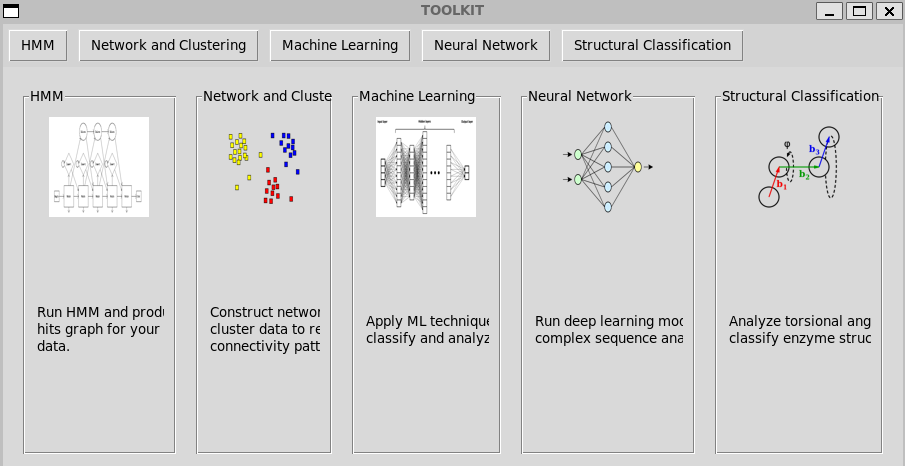

# GUI for Machine Learning-based Classification of Enzymes

This is a **Tkinter-based GUI toolkit** that serves as a launcher for various bioinformatics tools. It integrates multiple functionalities including HMM analysis, clustering, and machine learning (ML)/deep neural network (DNN)-based enzyme classification.



---

## Features

### HMM Analysis

- Browse and select input and target sequence files.
- Choose alignment method: Clustal Omega, ClustalW, or MAFFT.
- Automatically generates a `script.sh` that:
  - Aligns input sequences
  - Builds an HMM model using `hmmbuild`
  - Searches target sequences using `hmmsearch`
- Output:
  - Log file: `nohup_output.log`
  - Result: `output_table.txt`
- Users can visualize the top N hits and save them for downstream analysis.

**Example files**: `combined_laccase.fasta`, `query_input.fasta`

---

### 🧪 Clustering Module

- Upload a similarity matrix (e.g., from TM-align).
- Dimensionality reduction: MDS, PCA, or t-SNE.
- Clustering methods: Spectral, K-Means, GMM.
- Highlight specific nodes (e.g., top HMM hits).

**Example file**: `tmalign_matrix`

---

### Machine Learning & Neural Network Classifier

#### ML Pipeline
- Select training and independent FASTA files.
- Executes `ML_model.py`:
  - Feature extraction
  - Scaling and PCA
  - Classification using RF, SVM, or KNN
  - Saves predictions and confidence scores
- Visualize results with `ML_plotting.py`

**Example input**: `lac_perox.fasta`, `independent_lac_perox.fasta`

#### Feature Descriptors
- Amino acid composition & physicochemical properties
- G-gap dipeptide composition
- K-spaced amino acid pairs
- ESM (Evolutionary Scale Modeling) embeddings
- Structural angles (phi/psi) from AlphaFold models

#### Evaluation
- Uses 5-fold cross-validation
- Metrics: Accuracy, Precision, Recall, F1-score

---

### Neural Network Model (NN)

- Uses **ESM2 embeddings** and a deep feedforward neural network.
- Three hidden layers (256 → 128 → 64), dropout (40%), L2 regularization.
- PCA for dimensionality reduction.
- Optimizer: Adam | Activation: Softmax
- Labeling:
  - Laccase: 0
  - Peroxidase: 1
- Prediction on independent dataset with saved outputs.

---

### Structure-Based Classification

- After AlphaFold modeling, extract **phi (φ)** and **psi (ψ)** torsional angles.
- Convert to 360-bin probability distributions.
- Workflow:
  1. Extract angles and build features
  2. Preprocess and normalize data
  3. Train with SVM, RF, and KNN (5-fold cross-validation)
  4. Evaluate with Accuracy, F1-score, AUC, Confusion Matrix, ROC
  5. Predict independent dataset

**Example files**: `struct_indep.csv`, `struct_final.csv`

---

## Getting Started

### Clone the Repository
```bash
git clone git@github.com:Jithin-S-Sunny/gui-enzyme-classification.git
cd gui-enzyme-classification

